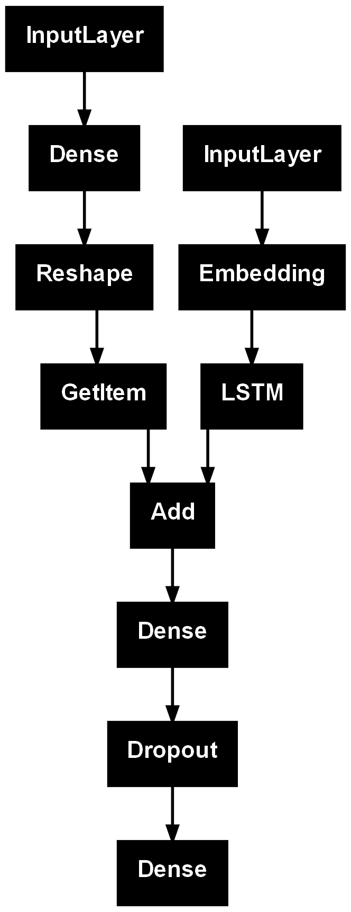

# Image Caption Generation Using CNN-LSTM with Beam Search Optimization

## Project Overview
This project implements an image caption generator that uses deep learning models to produce human-like textual descriptions of images. The system integrates:
- **InceptionV3** for image feature extraction.
- **LSTM-based RNN** for sequence generation.
- **Beam Search Optimization** to improve caption quality.

The project combines computer vision and natural language processing to bridge the gap between image understanding and textual generation.

---
## Author
**Sankalp Rajeev**  
This project is the **final submission** for the course **ECE5831**  at the **University of Michigan, Dearborn**.

---
## Key Features
- Image feature extraction using InceptionV3.
- Sequence generation using LSTM and GloVe embeddings.
- Beam Search implementation for optimal captions.
- Deployment via a Flask-based web application for real-time image captioning.

---

## Repository Contents
- **app.py**: Flask application for deployment.
- **final-project.ipynb**: Jupyter Notebook containing model training and evaluation.
- **features.pkl**: Precomputed image features extracted using the InceptionV3 model.
- **tokenizer.pkl**: Tokenizer object that maps words to indices for caption generation.
- **model\_new.keras**: Trained Keras model for generating captions.

---

## Installation and Setup

### Requirements
- Python 3.x
- TensorFlow/Keras
- Flask
- NumPy, Pandas, Pickle

### Setup Instructions
1. Clone the repository:

2. Run the Flask application:
    ```bash
    python app.py
    ```
3. Open your browser and go to:
    ```
    http://127.0.0.1:5000/
    ```
4. Upload an image and view the generated caption.

---

## Dataset
The model was trained on the **Flickr8k Dataset**. You can access the dataset here:  
[Download the Flickr8k Dataset](https://www.kaggle.com/datasets/adityajn105/flickr8k)

---

## Additional Resources
- **Google Drive (Project Files)**: [Google Drive Link](https://drive.google.com/drive/folders/18OZUeBjL5y-FdicXgfU55N78aBcFO2fI?usp=drive_link)  
- **Github**: [Github Link](https://github.com/srajeev234/ece5831-2024-final-project)
- **Presentation**: [Project Presentation](https://example.com/presentation)  
- **YouTube Demo**: [YouTube Demo Link](https://www.youtube.com/watch?v=pzuS7wjcyxs)
- **Slides** : [Link to slides](https://docs.google.com/presentation/d/1mFCTZFJyTdLR6VNEdT-oMyTM9_kmJiBF_O7iPJ0ez6I/edit?usp=sharing)

---

## Model Architecture
The system uses the following components:
- Pre-trained **InceptionV3** for image feature extraction.
- **LSTM** network for caption generation.
- **GloVe word embeddings** for improved language understanding.

### Diagram:


---

## Results

### Captions Generated:
| Image                         | Generated Caption                                |
|-------------------------------|-------------------------------------------------|
|               | "A black dog is running through the grass."      |
| .jpeg)        | "A man in a white wetsuit is surfing in the snow."|

---

## Future Work
- Integrate Transformer-based architectures (e.g., GPT, BERT) for better caption generation.
- Extend the system for video captioning.
- Add memory mechanisms to handle complex visual content.

---

## Acknowledgment
This project builds on the foundational work provided by **Quadeer Shaikh's Kaggle implementation**. Special thanks to OpenAI's ChatGPT for assistance in debugging and code optimization.

---

## References
- Q. Shaikh, *Flickr8k Image Captioning using CNNs \& LSTMs*, Kaggle Notebook.  
  [View here](https://www.kaggle.com/code/quadeer15sh/flickr8k-image-captioning-using-cnns-lstms/notebook)
- Vinyals et al., *Show and Tell: A Neural Image Caption Generator*, CVPR, 2015.  
  [Read the paper](https://arxiv.org/abs/1411.4555)

---
